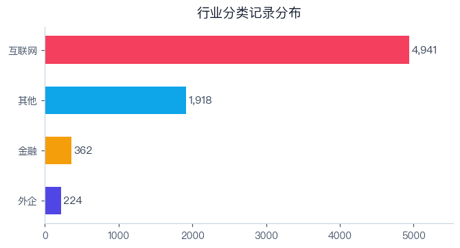
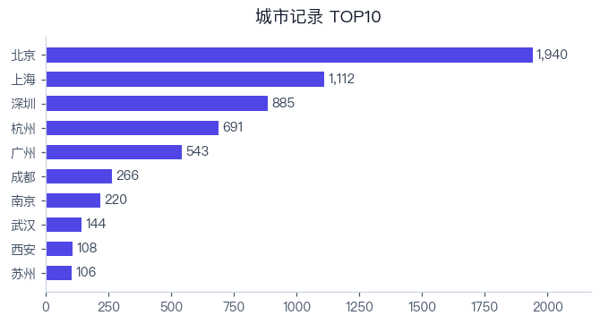
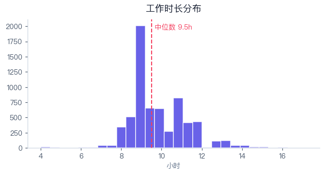
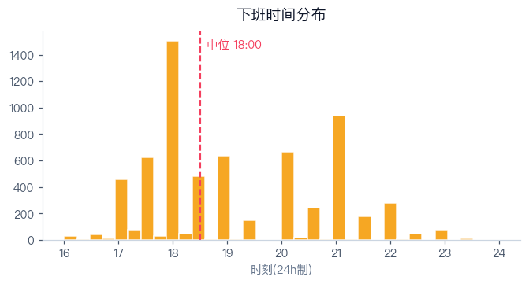
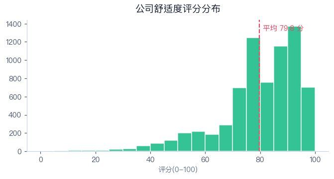
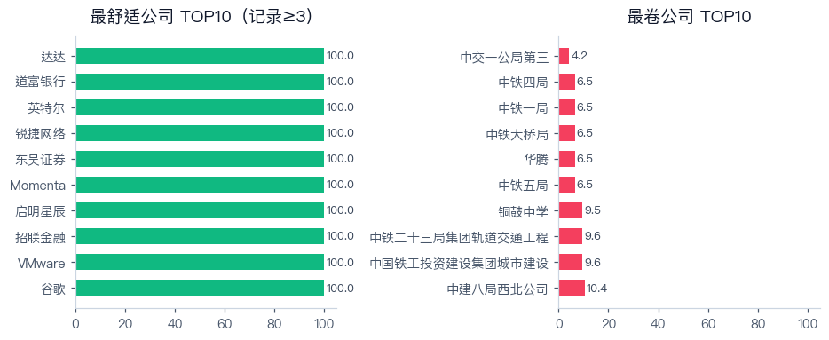

公司作息时间数据集
===

**请注意：本数据集来自匿名问卷与少量公开网络信息，未逐条核实，不属于[黑名单](../blacklist/README.md)/[白名单](../whitelist/README.md)的证据范畴，仅供求职与研究参考。**

数据来源
---
|来源|记录数|说明|
|:---:|:---:|:---|
|总表|6431|2021 年公开征集的公司作息问卷汇总|
|收集表(新增)|1008|同期问卷的补充记录（与总表去重后）|
|网络搜索|6|公开网络来源，来源链接见 `备注` 列，标注“待核实”的为网传说法|

概览
---
|指标|数值|
|:---|:---:|
|总记录数（去重后）|7445|
|覆盖公司数（规范名）|3391|
|覆盖城市数|243|
|平均上班 / 下班时间|09:11 / 18:23|
|平均 / 中位工作时长|9.7h / 9.5h|
|超 10 小时记录占比|31.5%|
|舒适公司数（评分 ≥ 85）|1973|

|分类|记录数|公司数|平均上班|平均下班|平均工时|平均评分|
|:---:|:---:|:---:|:---:|:---:|:---:|:---:|
|互联网|4941|1798|09:26|18:34|9.7|79.8|
|其他|1918|1412|08:39|17:57|9.6|78.4|
|外企|224|176|08:59|17:41|8.8|89.9|
|金融|362|227|08:39|17:53|9.5|80.0|

文件说明
---
|文件|内容|
|:---|:---|
|[data/全量明细.csv](data/全量明细.csv)|全部记录：原文与标准化后的上下班时间、工时、工作天数、部门/岗位/城市规范名、补齐标记、备注等|
|[data/公司汇总.csv](data/公司汇总.csv)|按公司聚合的平均作息与舒适度评分|
|[data/城市汇总.csv](data/城市汇总.csv)|按城市聚合|
|[data/分类统计.csv](data/分类统计.csv) / [行业细分统计.csv](data/行业细分统计.csv) / [工作天数分布.csv](data/工作天数分布.csv)|分组统计|
|[data/评分榜_最舒适TOP50.csv](data/评分榜_最舒适TOP50.csv) / [评分榜_最卷TOP30.csv](data/评分榜_最卷TOP30.csv)|评分榜（样本量小的公司排名波动大，请结合 `记录数` 看）|
|[data/网络搜索候选_待核实.csv](data/网络搜索候选_待核实.csv)|已找到讨论但缺少具体作息的公司|
|[data/公司别名映射.csv](data/公司别名映射.csv) / [规范化规则说明.csv](data/规范化规则说明.csv)|公司名归一与清洗规则|
|[charts/](charts/)|统计图表|

CSV 均为 UTF-8（带 BOM），可直接用 Excel 打开。

舒适度评分（0-100）
---
平均工时 45%（8h=100，每多 1h 扣 14）+ 工作天数 15%（5 天=100，每多 0.5 天扣 20）+ 平均下班 30%（18:00=100，每晚 1h 扣 15）+ 上班时间 10%（9:30 后=100）+ 周五早走奖励 3 分 − 超 10h 记录比例惩罚（最高 −10）。

等级：≥85 舒适 / 70-84 良好 / 55-69 一般 / 40-54 偏卷 / <40 很卷；无工时数据的公司记为“数据不足”。

图表
---

声明
---
- 数据为 2021 年前后的问卷填报，时效性有限；同公司不同部门、岗位差异很大，公司汇总不代表全部岗位。
- 缺失的城市/工作天数/上下班时间按同公司众数自动补齐，补齐字段记录在 `补齐标记` 列。
- 已移除问卷中的“建议”列，并删除备注中的邮箱、电话、微信/QQ 号、链接等联系方式。
- 如认为某条记录有误，欢迎提 Issue/PR 更正。
